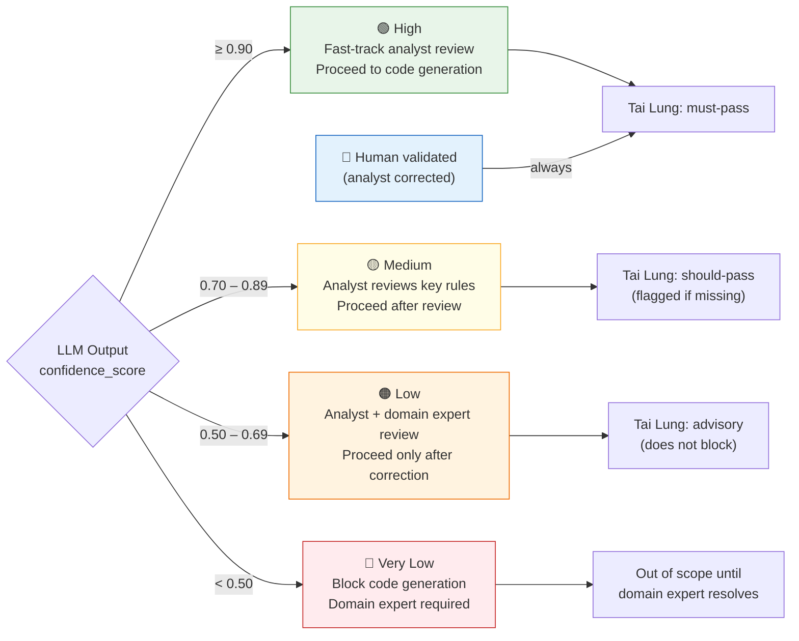
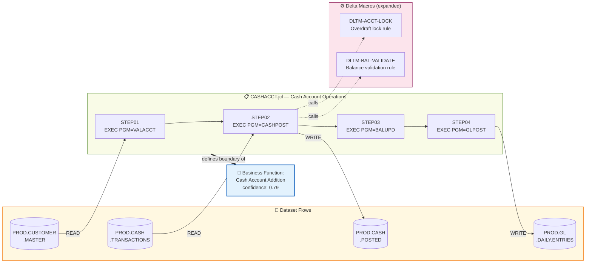
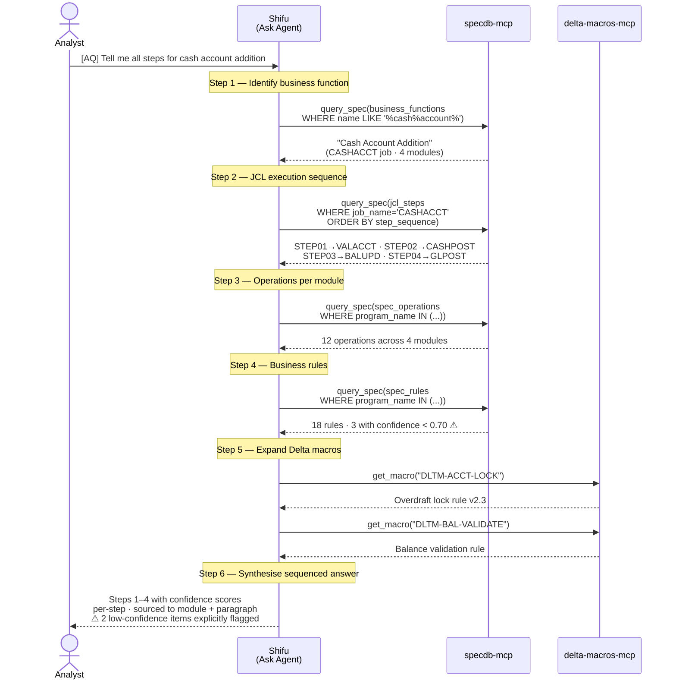

# Full Pipeline Workflow — Large-Scale COBOL Modernisation
## Reference Architecture for a 300-Module Application with JCLs

_Document status: Working draft — captures design intent and backlog implications_
_Date: 2026-03-03_

---

## Executive Summary

This document describes the end-to-end workflow for modernising a large COBOL mainframe application (300 modules, JCLs, Delta macros, copybooks) using the Mainframe Modernisation Agents pipeline.

The pipeline produces **business-capability-aligned modernisation epics** — not a 1:1 COBOL-program-to-Java-class conversion. A COBOL program boundary has no relationship to a modern service boundary. The pipeline's job is to discover what the business actually does and express it in a structure that makes sense for a modern architecture.

**Key design principles:**

1. **Capability-first, module-second** — modernisation epics are named after business capabilities ("Cash Account Addition"), not COBOL programs ("CASHPOST")
2. **Analyst in the expert seat** — no AI output reaches the spec layer or the downstream agents without explicit analyst review and approval
3. **Confidence transparency** — every LLM-produced output carries a confidence score; low-confidence items are flagged, never silently accepted
4. **Delta macros are first-class** — macro invocations are expanded inline into business logic, never treated as black boxes
5. **JCL defines process boundaries** — job boundaries from JCL define where a business process starts and ends, which modules are involved, and what data flows between them
6. **Ask anything** — once the spec layer is populated, analysts can ask natural-language questions about business logic and get traced, sourced answers

---

## Application Profile: What We're Dealing With

A typical 300-module COBOL mainframe application looks like this:

| Artefact type | Count | Notes |
|--------------|-------|-------|
| COBOL programs (.cbl/.cob) | ~300 | Mix of batch and online (CICS) |
| JCL job streams | ~80–120 | Batch job definitions, scheduling |
| JCL PROCs | ~20–30 | Reusable JCL procedures |
| Copybooks (.cpy) | ~100–200 | Shared data structures, called via COPY |
| Delta macros | ~50–150 | Client-specific shared business logic |
| VSAM/QSAM datasets | ~200–400 | Physical files referenced in DD statements |
| Embedded SQL (EXEC SQL) | In ~40% of modules | DB2 database calls |
| CICS transactions (EXEC CICS) | In ~20% of modules | Online/transactional programs |

**Complexity distribution (typical):**
- ~40% Low complexity — utility, report formatting, simple batch transforms
- ~45% Medium — business logic with some branching, moderate PERFORM nesting
- ~15% High — core business logic, heavy GOTOs/ALTERs, deep nesting, many anti-patterns

**Business functions (what the application actually does):**
A 300-module bank application typically has 15–30 distinct business capabilities:
Cash Account Management, Payroll Processing, Interest Calculation, GL Posting,
Month-End Close, Report Generation, Customer Onboarding, Compliance Reporting, etc.

The entire point of the pipeline is to discover these capabilities and restructure the code around them.

---

## Pipeline Overview

```mermaid
flowchart TD
    P0("⚙️ **Phase 0: Setup**\nConfigure engagement\nInit specdb schema · Ingest macros")
    P1("🐍 **Phase 1: Structural Analysis**\nViper × 300 modules\nParse · Call graphs · Complexity · Anti-patterns\nAnalyst triages · Approves semantic clusters")
    P2("📋 **Phase 2: JCL Analysis**\njcl-parser-mcp\nJob steps · PGM targets · Dataset flows\nDefines business process boundaries")
    P3("🏗️ **Phase 3: Dependency Mapping**\nCrane\nStatic CALL/COPY + Runtime JCL graph\nSubsystems · Circular deps · Migration order")
    P4("📖 **Phase 4: Business Rule Extraction**\nShifu — per module\nRules · Operations · Entities · Data flows\nDelta macros expanded · Confidence scored\nAnalyst validates: confirm / correct / reject")
    P5("🔍 **Phase 5: Business Function Clustering**\nShifu — cross-module\nGroups modules into named capabilities\nJCL boundaries + dependency graph + rules\nAnalyst corrects names and boundaries")
    P6("💬 **Phase 6: Ask Agent**\nShifu — AQ menu\nNatural language → graph traversal\nTraces modules + macros + JCL + rules\nEvery answer confidence-scored")
    P7("🗺️ **Phase 7: Migration Architecture**\nOogway\nBusiness functions → modernisation epics\nService boundaries · API contracts · Data model\nAnalyst approves before finalising")
    P8("📋 **Phase 8: Epic & Story Generation**\nPM Agent\nOogway architecture + Shifu business functions\n→ BMAD Epics + User Stories\nSM enriches each story with spec layer context")
    P9("⚒️ **Phase 9: Implementation & QA**\nBMAD Dev + QA method\nDev implements stories\nQA validates vs spec_rules\nConfidence-weighted sign-off")
    P10("🦁 **Phase 10: Delivery Management**\nTigress\nGitLab epics per business function\nIssues per module · Sprint dashboard")

    P0 --> P1 --> P2 --> P3 --> P4 --> P5 --> P6 --> P7 --> P8 --> P9 --> P10

    style P0 fill:#e8f5e9,stroke:#388e3c
    style P1 fill:#e3f2fd,stroke:#1565c0
    style P2 fill:#e3f2fd,stroke:#1565c0
    style P3 fill:#e3f2fd,stroke:#1565c0
    style P4 fill:#fff3e0,stroke:#e65100
    style P5 fill:#fff3e0,stroke:#e65100
    style P6 fill:#fff3e0,stroke:#e65100
    style P7 fill:#f3e5f5,stroke:#6a1b9a
    style P8 fill:#f3e5f5,stroke:#6a1b9a
    style P9 fill:#f3e5f5,stroke:#6a1b9a
    style P10 fill:#fce4ec,stroke:#880e4f
```



**Colour guide:** 🟢 Setup &nbsp;|&nbsp; 🔵 Discovery (Viper + JCL + Crane) &nbsp;|&nbsp; 🟠 Understanding (Shifu) &nbsp;|&nbsp; 🟣 Build (Oogway + Po + Tai Lung) &nbsp;|&nbsp; 🔴 Delivery (Tigress)

---

## Confidence Scoring Framework

Every LLM-produced output in the pipeline carries a `confidence_score` (0.00–1.00) and a `confidence_factors` list explaining any reductions. This is stored in the spec layer alongside the extracted data.

### Factors that reduce confidence

| Factor | Reduction | Rationale |
|--------|-----------|-----------|
| UNKNOWN_MACRO flag on a referenced macro | −0.15 per macro | Business logic inside the macro is unknown |
| ALTER statement detected in module | −0.20 | Self-modifying code — control flow cannot be fully traced |
| Paragraph reachable only via GO TO (fallthrough) | −0.15 | Control flow is disrupted; rule may not apply universally |
| Cryptic paragraph name (numeric, single-word, e.g. `PARA-9999`) | −0.20 | No naming signal for business meaning |
| Zero COBOL comments in the source paragraph | −0.10 | Business intent must be inferred from variable names alone |
| Business rule assembled from cross-module inference | −0.15 | Connection assumed from call graph, not explicit logic |
| Delta macro definition is partial or template-only | −0.20 | Expansion is incomplete |
| Conflicting rules detected across modules for same entity | −0.30 | Contradiction requires domain expert resolution |
| EXEC CICS construct in paragraph | −0.05 | CICS state management may affect rule applicability |
| High goto_count on module (≥5) | −0.10 | General unreliability of control flow analysis |

### Confidence bands

| Band | Score | Analyst action |
|------|-------|---------------|
| **High** | 0.90–1.00 | Fast-track review; likely correct |
| **Medium** | 0.70–0.89 | Analyst should review key rules before approving |
| **Low** | 0.50–0.69 | Analyst must review; domain expert recommended |
| **Very Low** | < 0.50 | Flag for domain expert; do NOT proceed to code generation |



### Where confidence scores appear

- `spec_rules.confidence_score` — per extracted business rule
- `spec_operations.confidence_score` — per named operation
- `spec_entities.confidence_score` — per data entity
- Business function cluster confidence — aggregate of member module scores
- Ask Agent responses — per answer section, per sourced fact
- Oogway architecture — flags business functions with mean confidence < 0.70
- Tai Lung validation — high-confidence rules are must-pass; low-confidence rules are advisory

---

## Phase-by-Phase Walkthrough

### Phase 0: Setup (Day 1)

1. Install the expansion pack (Epic 9 installer)
2. Edit `config.yaml`: set `db_path`, `macro_library_path`, `gitlab_url`, `project_name`
3. Call `init_schema` via `specdb-mcp` — creates all tables
4. Ingest Delta macro library: drop all `.md` macro files into `macro_library_path`, run batch ingestion via `delta-macros-mcp`
5. Confirm: `query_spec("SELECT COUNT(*) FROM cobol_files")` returns 0 (empty, ready)

**Output:** Empty specdb, macro library loaded, engagement configured

---

### Phase 1: Structural Analysis — Viper × 300

**Duration estimate:** 2–3 weeks (including analyst review time)

#### 1a. Batch Phase 1 (new capability needed)

Currently Viper processes one module at a time. For 300 modules, a batch mode is needed:

```
Viper [BA] Batch Analysis
→ Scan directory for all .cbl/.cob files
→ Run Phase 1 (parse_module, extract_call_graph, score_complexity,
               detect_antipatterns, get_macro per delta macro) on each
→ Write all results to specdb
→ Produce a triage report
```

The triage report shows:

```
Batch Phase 1 Complete — 300 modules processed

Complexity distribution:
  Low    (120 modules, 40%): fast-track candidate
  Medium (135 modules, 45%): standard review
  High    (45 modules, 15%): deep analyst attention required

Flags requiring attention:
  UNKNOWN_MACRO:         23 occurrences across 12 modules
  CICS_CONSTRUCT:        847 occurrences across 61 modules
  DB2_SQL_CONSTRUCT:     412 occurrences across 38 modules
  ALTER detected:         3 modules — priority review
  Circular dependencies:  2 pairs detected (see Crane Phase 3)
```

#### 1b. Analyst triage strategy

| Complexity | Approach | Estimated time per module |
|-----------|----------|--------------------------|
| Low | Review Phase 1 summary (30 sec), accept AI clusters as-is | 2–5 min |
| Medium | Review Phase 1, review clusters, minor corrections | 10–20 min |
| High | Full Phase 1 review, correct clusters, flag concerns | 30–60 min |

**Total analyst time estimate:** ~120 hrs for 300 modules at a realistic mix

#### 1c. What goes into specdb after Phase 1

For every module:
- `cobol_files`: program_name, source_path, line_count
- `analyses`: paragraph_list (JSON), call_graph (JSON edges), external_refs
- `metrics`: complexity_score, paragraph_count, goto_count, nested_perform_depth, antipatterns (JSON)
- `dependencies`: one row per COPY ref + one row per CALL target

---

### Phase 2: JCL Analysis — jcl-parser-mcp (new)

**Duration estimate:** 3–5 days

#### What JCL parsing produces

For each `.jcl` file:

```jcl
//CASHACCT JOB (ACCT),'Cash Account Ops',CLASS=A
//STEP01   EXEC PGM=VALACCT
//CUSTFILE DD DSN=PROD.CUSTOMER.MASTER,DISP=SHR
//STEP02   EXEC PGM=CASHPOST
//INFILE   DD DSN=PROD.CASH.TRANSACTIONS,DISP=SHR
//OUTFILE  DD DSN=PROD.CASH.POSTED,DISP=(NEW,CATLG)
//STEP03   EXEC PGM=BALUPD
//STEP04   EXEC PGM=GLPOST
//STEP05   EXEC PROC=STDPRINT
```

Parsed into new specdb tables (to be added in schema migration):

**`jcl_jobs`**
| job_name | jcl_path | description |
|---------|---------|-------------|
| CASHACCT | jobs/CASHACCT.jcl | Cash Account Ops |

**`jcl_steps`**
| job_name | step_sequence | step_name | program_name | proc_name |
|---------|--------------|-----------|-------------|---------|
| CASHACCT | 1 | STEP01 | VALACCT | null |
| CASHACCT | 2 | STEP02 | CASHPOST | null |
| CASHACCT | 3 | STEP03 | BALUPD | null |
| CASHACCT | 4 | STEP04 | GLPOST | null |
| CASHACCT | 5 | STEP05 | null | STDPRINT |

**`dataset_allocations`**
| job_name | step_name | dd_name | dsn | disposition | direction |
|---------|----------|---------|-----|------------|----------|
| CASHACCT | STEP01 | CUSTFILE | PROD.CUSTOMER.MASTER | SHR | READ |
| CASHACCT | STEP02 | INFILE | PROD.CASH.TRANSACTIONS | SHR | READ |
| CASHACCT | STEP02 | OUTFILE | PROD.CASH.POSTED | NEW,CATLG | WRITE |

#### How JCL defines the business process boundary



#### Why this matters

- `CASHACCT` JCL tells you exactly which programs constitute "cash account addition" and in what order
- `PROD.CASH.TRANSACTIONS` → `PROD.CASH.POSTED` tells you the data flow between steps
- Without JCL, you only know `CASHPOST` exists; you don't know it's step 2 of 5 in a cash processing job

---

### Phase 3: Cross-Module Dependency Mapping — Crane

**Duration estimate:** 1 week

Crane consumes **two** dependency sources:

| Source | Type | What it captures |
|--------|------|-----------------|
| `dependencies` table (from Viper) | Static | COPY copybook references, CALL targets in source |
| `jcl_steps` table (from JCL parser) | Runtime | Which programs run in which jobs, in what sequence |
| `dataset_allocations` (from JCL parser) | Data flow | Which programs read/write which datasets |

#### Crane outputs

1. **Full dependency graph** — Mermaid diagram covering static + runtime + data-flow edges
2. **Subsystem clusters** — groups of modules that form coherent subsystems (e.g., "GL Subsystem", "Customer Master", "Batch Posting")
3. **Migration order** — topological sort: which subsystems to modernise first (those with fewest dependencies on others)
4. **Circular dependency report** — pairs that must be refactored before migration
5. **Dead code report** — modules never called by any JCL job or any other module

---

### Phase 4: Business Rule Extraction — Shifu (per module)

**Duration estimate:** 4–6 weeks (including analyst validation)

#### What Shifu does per module

For each module, Shifu reads from the spec layer and the source:

1. **For each paragraph**: extract the business operation it performs
2. **For each Delta macro call**: call `get_macro(macro_name)` → expand the macro's business logic inline
3. **Assign confidence scores** based on the confidence framework above
4. **Write to specdb**:
   - `spec_operations`: named operations with description, source paragraph, confidence
   - `spec_rules`: business rules with type, description, source paragraph, confidence
   - `spec_entities`: data entities (Account, Balance, Transaction) with description, confidence
   - `spec_data_flows`: from_entity → to_entity transformations per paragraph

#### Delta macro expansion example

Without expansion:
```
CASHPOST paragraph 2300-LOCK-ACCOUNT:
  Operation: Lock account [via DLTM-ACCT-LOCK]
  Confidence: 0.60 (UNKNOWN_MACRO −0.15, cryptic paragraph name −0.20, no comments −0.10)
```

With expansion (after `get_macro("DLTM-ACCT-LOCK")` succeeds):
```
CASHPOST paragraph 2300-LOCK-ACCOUNT:
  Operation: Lock account when negative balance threshold is reached
  Rule: When WS-BALANCE < 0 AND WS-BALANCE > WS-OVERDRAFT-LIMIT:
        Set ACCT-STATUS = 'LOCKED'; raise ACCT-LOCKED-FLAG;
        Prevent further debit transactions until manual review
        [DLTM-ACCT-LOCK v2.3 — enforces REGL-OVERDRAFT-POLICY]
  Confidence: 0.82 (cross-module inference −0.15, otherwise clean)
```

#### Analyst validation workflow

Shifu presents each module's extracted rules for analyst review:
- **Confirm**: rule is correct as extracted
- **Correct**: analyst rewrites the rule description (confidence set to 1.00 — human authority)
- **Reject**: rule is incorrect / not a real business rule (removed from spec layer)

Analyst-corrected rules are marked `human_validated: true` and always used as must-pass in QA.

---

### Phase 5: Business Function Clustering — Shifu (cross-module)

**Duration estimate:** 1 week + analyst review

After all 300 modules are processed, Shifu identifies **business capabilities** that span multiple modules. This is the key step that transforms a COBOL module inventory into a modern backlog.

#### Inputs

1. JCL jobs + step sequences → defines what programs run together for a business process
2. Crane subsystem clusters → groups of structurally related modules
3. `spec_operations` across all modules → what each module does in business language
4. `dependencies` graph → CALL chains that link modules within a business process

#### How business functions are identified

```
Business Function: "Cash Account Addition"
  ─────────────────────────────────────────────────────────
  JCL entry point:  CASHACCT job (from jcl_jobs)
  Member modules:   VALACCT, CASHPOST, BALUPD, GLPOST
  Triggered by:     STEP01→STEP02→STEP03→STEP04 (sequential)
  Datasets:         PROD.CUSTOMER.MASTER (read)
                    PROD.CASH.TRANSACTIONS (read)
                    PROD.CASH.POSTED (write)
  Delta macros:     DLTM-ACCT-LOCK, DLTM-BAL-VALIDATE (expanded)
  Aggregate confidence: 0.79 (Medium)
  ─────────────────────────────────────────────────────────
  Sub-operations:
    1. Validate account is active and eligible  [VALACCT, confidence 0.91]
    2. Post cash transaction to account         [CASHPOST, confidence 0.82]
    3. Apply overdraft lock if threshold exceeded [CASHPOST via DLTM-ACCT-LOCK, 0.82]
    4. Update running account balance           [BALUPD, confidence 0.88]
    5. Post offsetting entry to General Ledger  [GLPOST, confidence 0.85]
```

Confidence for the business function = weighted average of member module rule confidence scores. Functions with aggregate confidence < 0.70 are flagged for deeper analyst review before architecture proceeds.

#### Analyst review of business functions

Analyst can:
- Rename a function ("Cash Account Addition" → "Cash Deposit Processing")
- Merge two functions that should be one capability
- Split a function that covers two distinct capabilities
- Add a module to a function (if Shifu missed a static CALL relationship)
- Correct the JCL entry point association

---

### Phase 6: Ask Agent — Shifu [AQ] (new capability)

The Ask Agent is a menu option inside Shifu, not a standalone agent. It has full access to the populated spec layer and uses `query_spec` to retrieve data, then synthesises answers using LLM reasoning.

#### How a query works: "Tell me all the steps for cash account addition"

```
Analyst: [AQ] Tell me all the steps for cash account addition

Shifu Ask Agent reasoning:

Step 1 — Identify relevant business function
  query_spec: SELECT * FROM business_functions WHERE name LIKE '%cash%account%'
  → found: "Cash Account Addition" (CASHACCT job, modules VALACCT/CASHPOST/BALUPD/GLPOST)

Step 2 — Retrieve JCL execution sequence
  query_spec: SELECT * FROM jcl_steps WHERE job_name = 'CASHACCT' ORDER BY step_sequence
  → STEP01: VALACCT, STEP02: CASHPOST, STEP03: BALUPD, STEP04: GLPOST

Step 3 — Retrieve operations per module in sequence
  query_spec: SELECT * FROM spec_operations WHERE program_name IN (...)
              ORDER BY program_name, source_paragraph
  → 12 operations across 4 modules

Step 4 — Retrieve business rules per module
  query_spec: SELECT * FROM spec_rules WHERE program_name IN (...)
  → 18 rules, including 3 with confidence < 0.70 (flagged)

Step 5 — Expand any Delta macros referenced
  get_macro("DLTM-ACCT-LOCK") → expanded definition
  get_macro("DLTM-BAL-VALIDATE") → expanded definition

Step 6 — Synthesise sequenced answer

Answer:

═══════════════════════════════════════════════════════════════
  CASH ACCOUNT ADDITION — Complete Business Flow
  Source: CASHACCT job · 4 modules · 2 Delta macros
  Aggregate confidence: 0.79 (Medium)
═══════════════════════════════════════════════════════════════

Step 1 — Account Validation  [VALACCT, confidence: 0.91]
  • Verify account number exists in PROD.CUSTOMER.MASTER
  • Confirm account status is ACTIVE (not CLOSED, FROZEN, or DORMANT)
  • Validate account type is eligible for cash transactions (CURRENT, SAVINGS)
  • Rule: If account not found → ABEND with code AC001 [confidence: 0.91]
  • Rule: If account FROZEN → reject with code AC003, raise compliance flag [confidence: 0.88]

Step 2 — Transaction Posting  [CASHPOST, confidence: 0.82]
  • Read transaction record from PROD.CASH.TRANSACTIONS
  • Validate transaction amount > 0 and ≤ daily limit
  • Post transaction to account ledger
  • Rule: Daily limit = WS-DAILY-LIMIT from customer profile [confidence: 0.82]
  • Rule: If amount exceeds limit → reject, generate exception record [confidence: 0.79]

Step 2a — Overdraft Lock Check  [CASHPOST via DLTM-ACCT-LOCK, confidence: 0.82]
  • If posted balance < 0 AND balance > overdraft limit:
    Set account status = LOCKED
    Prevent further debits until manual review
    [DLTM-ACCT-LOCK v2.3 — REGL-OVERDRAFT-POLICY]

Step 3 — Balance Update  [BALUPD, confidence: 0.88]
  • Recalculate running balance = previous balance + transaction amount
  • Update balance record in PROD.CUSTOMER.MASTER
  • Write audit trail record
  ⚠ Rule: Rounding logic [confidence: 0.58 — LOW, requires domain expert review]
    Paragraph ROUND-BAL has cryptic name, no comments, and contains GO TO

Step 4 — General Ledger Posting  [GLPOST, confidence: 0.85]
  • Create offsetting GL entry (debit cash account, credit suspense)
  • Post to PROD.GL.DAILY.ENTRIES
  • Rule: GL account code derived from transaction type mapping table [confidence: 0.85]

───────────────────────────────────────────────────────────────
⚠ LOW CONFIDENCE ITEMS REQUIRING REVIEW:
  1. BALUPD paragraph ROUND-BAL (confidence 0.58):
     Rounding logic unclear — domain expert required before code generation
  2. CASHPOST UNKNOWN reference to DLTM-RATE-TABLE (confidence reduced −0.15):
     Macro not found in library — may contain additional validation rules
───────────────────────────────────────────────────────────────
```

#### Ask Agent query flow



#### What makes the Ask Agent powerful

- It traces **across module boundaries** automatically (not just within CASHPOST)
- It **expands Delta macros inline** so the answer is complete
- It **uses JCL sequence** to get the correct execution order
- It **flags low-confidence portions** rather than presenting them as fact
- Every statement is **sourced** to a module, paragraph, and spec table row

---

### Phase 7: Migration Architecture — Oogway

Oogway consumes the business function catalogue (from Shifu) and produces the target architecture.

The critical change from the current plan: **Oogway organises by business function, not COBOL module**.

```
Current (module-centric, wrong):
  Epic: Modernise CASHPOST.cbl
  Epic: Modernise BALUPD.cbl
  Epic: Modernise GLPOST.cbl

Correct (capability-centric):
  Epic: Cash Account Addition Service
    Story: Account validation API endpoint
    Story: Transaction posting service
    Story: Balance update with overdraft detection
    Story: GL posting integration
    Story: Unit tests for REGL-OVERDRAFT-POLICY rules
```

Business functions with aggregate confidence < 0.70 are flagged in the architecture document with a recommendation to complete domain expert review before code generation begins.

---

### Phase 8: Epic & Story Generation — PM Agent

**Duration estimate:** 1–2 days

This is where the pipeline hands over to the **standard BMAD development method**. The PM agent reads two outputs from the pipeline and converts them into a structured BMAD backlog:

**Input 1: Oogway architecture** — service boundaries, API contracts, target data model
**Input 2: Shifu business function catalog** — named capabilities, member modules, operations, rules, confidence scores

#### PM creates BMAD Epics — one per business capability

```
Epic: Cash Account Addition Service
  Source:    business_functions → "Cash Account Addition"
  JCL entry: CASHACCT job (defines process boundary)
  Modules:   VALACCT, CASHPOST, BALUPD, GLPOST
  Confidence: 0.79 (Medium) — analyst review required on Step 3 balance rounding
```

Not "Epic: Modernise CASHPOST.cbl" — the module boundary is an implementation detail, not a business capability.

#### PM creates User Stories within each Epic — one per service boundary

Each story maps to an operation defined by Oogway's architecture:

```
Story: Account Validation Service
  As a developer, I want to implement the account validation service
  that verifies account existence and eligibility for cash transactions.
  Source module: VALACCT · Confidence: 0.91 (High)
  Business rules: [3 rules from spec_rules, all confidence ≥ 0.88]

Story: Transaction Posting Service
  ...

Story: Balance Update with Overdraft Detection
  Source module: BALUPD · Confidence: 0.88 (High)
  ⚠ Low-confidence item: ROUND-BAL paragraph (0.58) — domain expert input required

Story: GL Posting Integration
  ...
```

Stories with aggregate confidence < 0.70 are flagged for domain expert review before dev picks them up.

#### SM enriches each story with spec layer context

Before a story enters a sprint, the SM queries the spec layer and embeds the full business context directly into the story file:

- `spec_rules` → acceptance criteria (high-confidence = must-pass, medium = should-pass)
- `spec_operations` → API operation signatures
- `spec_entities` → data model and field names
- `spec_data_flows` → input/output contracts
- Delta macro expansions → inline business logic in acceptance criteria
- Confidence scores → flagged prominently for any item below 0.70

The SM-enriched story is a self-contained implementation spec. The Dev agent does not need to query the spec layer directly — all context is embedded.

---

### Phase 9: Implementation & QA — BMAD Dev + QA Method

**Duration estimate:** 6–10 weeks for a 300-module application (parallelisable per Epic)

Standard BMAD development loop per story:

1. **Dev** implements the story using the SM-enriched context as the spec
   - High-confidence rules → implemented as core logic
   - Low-confidence rules → implemented with TODO comments and test placeholders for domain expert review
   - Delta macro-derived rules → implemented inline with a reference comment to the macro version

2. **QA** validates the implementation against `spec_rules`, confidence-weighted:

| Rule confidence | Validation requirement |
|----------------|----------------------|
| ≥ 0.90 (high) | Must pass — blocks sign-off |
| 0.70–0.89 (medium) | Should pass — flagged if missing |
| 0.50–0.69 (low) | Advisory — reported but does not block |
| < 0.50 (very low) | Out of scope until domain expert resolves |
| `human_validated: true` | Always must-pass regardless of original confidence |

3. Stories that fail QA gate are returned to Dev for rework. Tigress tracks this in GitLab.

The spec layer is the **single source of truth for acceptance criteria** — QA does not need to re-read the COBOL source.

---

## The Ask Agent in Practice: More Query Examples

Once the spec layer is fully populated (after Phase 5), analysts can ask:

| Question | What the agent does |
|----------|-------------------|
| "What validation rules apply to cash withdrawals?" | Queries spec_rules WHERE description LIKE '%cash%withdraw%' across all modules |
| "Which modules write to the General Ledger?" | Queries spec_data_flows for GL entity writes + dataset_allocations for GL DSNs |
| "What happens when an account goes into overdraft?" | Traces DLTM-ACCT-LOCK expansion + CASHPOST rules + BALUPD rules |
| "Which business functions have low confidence and need expert review?" | Queries business_functions WHERE aggregate_confidence < 0.70 |
| "What are all the downstream effects of changing the daily limit?" | Traces spec_rules LIKE '%daily%limit%' across all modules + call graph |
| "Show me all rules that reference REGL-OVERDRAFT-POLICY" | Queries spec_rules WHERE description LIKE '%REGL-OVERDRAFT%' |
| "Which programs does the CASHACCT job call in order?" | Queries jcl_steps WHERE job_name = 'CASHACCT' ORDER BY step_sequence |

---

## What Needs to Be Built (Backlog)

The following capabilities are needed beyond what Epic 1–3 deliver:

### Epic 4 addition: `jcl-parser-mcp` — new MCP server

JCL parser is a proper MCP server (same pattern as `cobol-parser-mcp` in Epic 3), not a pipeline phase. Epic 4 includes its implementation stories alongside the Crane agent:

- **Story 4-1: jcl-parser-mcp core parsing**
  - `parse_jcl(job_name, jcl_path)` → parses EXEC PGM=, EXEC PROC=, JOB card
  - `list_job_steps(job_name)` → step sequence with program/proc targets
  - New specdb tables written: `jcl_jobs`, `jcl_steps`
  - specdb-mcp schema migration included in this story

- **Story 4-2: jcl-parser-mcp dataset allocations**
  - `get_dataset_allocations(job_name)` → DD statements, DSNs, disposition, infer READ/WRITE direction
  - `build_job_graph(job_names[])` → runtime execution order across multiple jobs (chain deps)
  - New specdb table: `dataset_allocations`

- **Story 4-3: Crane BMAD agent definition** (Crane agent now has both static + JCL deps available)
- **Story 4-4: Crane workflow and step files**

### Epic 4: Viper batch Phase 1 mode
- `[BA]` menu item: scan directory, run Phase 1 on all modules, produce triage report
- Triage report: complexity distribution, flag summary, modules requiring analyst attention
- Needed before running Viper on a 300-module estate

### Epic 5: Shifu — Delta macro expansion
- When extracting business rules, call `get_macro()` for every macro referenced in a paragraph
- Expand macro definition inline into the rule description
- If macro unknown → confidence reduced, flagged, inline placeholder inserted

### Epic 5: Shifu — Confidence scoring
- Calculate confidence score per rule/operation/entity based on the framework in this document
- Store `confidence_score` and `confidence_factors` in spec layer
- Surface low-confidence items prominently in analyst review
- Add `confidence_score`, `confidence_factors`, `human_validated` columns to spec_* tables

### Epic 5: Shifu — Cross-module business function clustering
- After all modules processed: use JCL jobs + Crane subsystems + spec_operations to cluster
- Name business capabilities in plain English
- Write to new `business_functions` specdb table
- Analyst reviews and corrects function names/boundaries

### Epic 5: Shifu — Ask Agent `[AQ]` menu item
- Natural language → multi-step query planning → `query_spec` execution → synthesis
- Cross-module graph traversal + Delta macro expansion in answers
- Confidence scoring on answer sections
- Low-confidence items explicitly flagged in output

### Epic 7: Oogway — Business-function-centric architecture output
- Generate architecture from business functions, not COBOL modules
- Each epic = one business capability; stories = service boundaries
- Architecture document feeds directly into PM Epic 8 story generation

### Epic 8: PM — Epic & Story generation from business functions
- PM step file that reads `business_functions` + Oogway architecture → produces BMAD Epic/Story files
- One Epic per business capability; one Story per service boundary
- Stories flagged with confidence scores; stories < 0.70 tagged for domain expert review

### Epic 8: SM — Spec layer context enrichment workflow
- SM step file that calls `query_spec` for rules/operations/entities/data_flows per story
- Embeds business rules as acceptance criteria directly in story file
- Inline Delta macro expansions; confidence annotations; low-confidence items flagged

---

## Confidence Score Storage (Schema Extension Required)

```sql
-- Extension to existing spec_rules, spec_operations, spec_entities, spec_data_flows
ALTER TABLE spec_rules ADD COLUMN confidence_score REAL DEFAULT 1.0;
ALTER TABLE spec_rules ADD COLUMN confidence_factors TEXT;  -- JSON array
ALTER TABLE spec_rules ADD COLUMN human_validated INTEGER DEFAULT 0;

-- New: business functions table
CREATE TABLE IF NOT EXISTS business_functions (
    id INTEGER PRIMARY KEY AUTOINCREMENT,
    function_name TEXT NOT NULL UNIQUE,
    description TEXT,
    jcl_job_name TEXT,                  -- primary JCL entry point
    member_modules TEXT NOT NULL,       -- JSON array of program_names
    aggregate_confidence REAL,
    confidence_factors TEXT,            -- JSON array
    analyst_approved INTEGER DEFAULT 0,
    created_at TEXT NOT NULL DEFAULT '',
    updated_at TEXT NOT NULL DEFAULT ''
);

-- New: JCL tables
CREATE TABLE IF NOT EXISTS jcl_jobs (
    id INTEGER PRIMARY KEY AUTOINCREMENT,
    job_name TEXT NOT NULL UNIQUE,
    jcl_path TEXT NOT NULL,
    description TEXT,
    created_at TEXT NOT NULL DEFAULT ''
);

CREATE TABLE IF NOT EXISTS jcl_steps (
    id INTEGER PRIMARY KEY AUTOINCREMENT,
    job_name TEXT NOT NULL,
    step_sequence INTEGER NOT NULL,
    step_name TEXT NOT NULL,
    program_name TEXT,
    proc_name TEXT,
    FOREIGN KEY (job_name) REFERENCES jcl_jobs(job_name)
);

CREATE TABLE IF NOT EXISTS dataset_allocations (
    id INTEGER PRIMARY KEY AUTOINCREMENT,
    job_name TEXT NOT NULL,
    step_name TEXT NOT NULL,
    dd_name TEXT NOT NULL,
    dsn TEXT NOT NULL,
    disposition TEXT,
    direction TEXT,  -- 'READ', 'WRITE', 'READ_WRITE'
    FOREIGN KEY (job_name) REFERENCES jcl_jobs(job_name)
);
```

---

## Scale: What 300 Modules Actually Looks Like on a Timeline

| Phase | Duration | Analyst effort | Can be parallelised? |
|-------|----------|---------------|---------------------|
| 0: Setup | 1 day | ½ day | No |
| 1: Viper structural (batch Phase 1) | 1 week | 3–4 weeks review | Phase 1 batch: yes; analyst review: no |
| 2: JCL analysis | 3–5 days | 1 day review | Yes |
| 3: Crane dependency mapping | 3–5 days | 2 days review | Yes |
| 4: Shifu business rules | 3–4 weeks | 4–6 weeks validation | Per-module: yes; validation: no |
| 5: Business function clustering | 1 week | 1 week review | No (cross-module) |
| 6: Ask Agent (ongoing) | Continuous | On-demand | N/A |
| 7: Oogway architecture | 1 week | 1 week review | No |
| 8: PM Epic & Story generation | 1–2 days | 1–2 days | No |
| 9: SM + Dev + QA (BMAD) | 6–10 weeks | Continuous | Per-story: yes |
| 10: Tigress GitLab | Continuous | Minimal | Yes |

**Approximate total calendar time:** 5–7 months for a 300-module application
**Approximate analyst effort:** 10–15 weeks total (across all phases)
**Critical path:** Analyst validation time in Phases 1, 4, and 5

The biggest bottleneck is not the AI tooling — it is analyst review time. The confidence scoring framework directly addresses this: analysts spend most time on low-confidence items and fast-track high-confidence ones.

---

_This document captures the target pipeline design as of 2026-03-03. Stories for new capabilities (jcl-parser-mcp as Epic 4 stories, batch Viper, Shifu Ask Agent, confidence scoring, business function clustering, PM/SM BMAD enrichment workflows) are to be created as formal story files in the implementation artifacts. Phases 8–9 use the standard BMAD PM → SM → Dev → QA method — no custom code-generation or QA agents are required._
